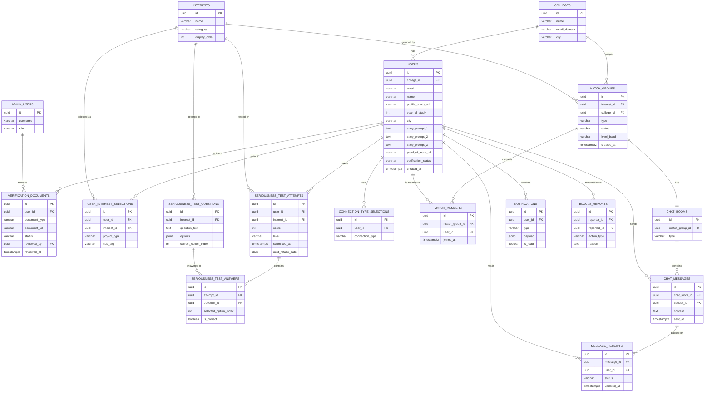

```mermaid
erDiagram
    COLLEGES ||--o{ USERS : has
    USERS ||--o{ VERIFICATION_DOCUMENTS : uploads
    USERS ||--o{ USER_INTEREST_SELECTIONS : selects
    INTERESTS ||--o{ USER_INTEREST_SELECTIONS : "selected as"
    USERS ||--o{ SERIOUSNESS_TEST_ATTEMPTS : takes
    INTERESTS ||--o{ SERIOUSNESS_TEST_ATTEMPTS : "tested on"
    INTERESTS ||--o{ SERIOUSNESS_TEST_QUESTIONS : "belongs to"
    SERIOUSNESS_TEST_ATTEMPTS ||--o{ SERIOUSNESS_TEST_ANSWERS : contains
    SERIOUSNESS_TEST_QUESTIONS ||--o{ SERIOUSNESS_TEST_ANSWERS : "answered in"
    USERS ||--o{ CONNECTION_TYPE_SELECTIONS : sets
    COLLEGES ||--o{ MATCH_GROUPS : scopes
    INTERESTS ||--o{ MATCH_GROUPS : "grouped by"
    MATCH_GROUPS ||--o{ MATCH_MEMBERS : contains
    USERS ||--o{ MATCH_MEMBERS : "is member of"
    MATCH_GROUPS ||--|| CHAT_ROOMS : has
    CHAT_ROOMS ||--o{ CHAT_MESSAGES : contains
    USERS ||--o{ CHAT_MESSAGES : sends
    CHAT_MESSAGES ||--o{ MESSAGE_RECEIPTS : "tracked by"
    USERS ||--o{ MESSAGE_RECEIPTS : reads
    USERS ||--o{ NOTIFICATIONS : receives
    USERS ||--o{ BLOCKS_REPORTS : "reports/blocks"
    ADMIN_USERS ||--o{ VERIFICATION_DOCUMENTS : reviews

    COLLEGES {
        uuid id PK
        varchar name
        varchar email_domain
        varchar city
    }
    USERS {
        uuid id PK
        uuid college_id FK
        varchar email
        varchar name
        varchar profile_photo_url
        int year_of_study
        varchar city
        text story_prompt_1
        text story_prompt_2
        text story_prompt_3
        varchar proof_of_work_url
        varchar verification_status
        timestamptz created_at
    }
    VERIFICATION_DOCUMENTS {
        uuid id PK
        uuid user_id FK
        varchar document_type
        varchar document_url
        varchar status
        uuid reviewed_by FK
        timestamptz reviewed_at
    }
    INTERESTS {
        uuid id PK
        varchar name
        varchar category
        int display_order
    }
    USER_INTEREST_SELECTIONS {
        uuid id PK
        uuid user_id FK
        uuid interest_id FK
        varchar project_type
        varchar sub_tag
    }
    SERIOUSNESS_TEST_QUESTIONS {
        uuid id PK
        uuid interest_id FK
        text question_text
        jsonb options
        int correct_option_index
    }
    SERIOUSNESS_TEST_ATTEMPTS {
        uuid id PK
        uuid user_id FK
        uuid interest_id FK
        int score
        varchar level
        timestamptz submitted_at
        date next_retake_date
    }
    SERIOUSNESS_TEST_ANSWERS {
        uuid id PK
        uuid attempt_id FK
        uuid question_id FK
        int selected_option_index
        boolean is_correct
    }
    CONNECTION_TYPE_SELECTIONS {
        uuid id PK
        uuid user_id FK
        varchar connection_type
    }
    MATCH_GROUPS {
        uuid id PK
        uuid interest_id FK
        uuid college_id FK
        varchar type
        varchar status
        varchar level_band
        timestamptz created_at
    }
    MATCH_MEMBERS {
        uuid id PK
        uuid match_group_id FK
        uuid user_id FK
        timestamptz joined_at
    }
    CHAT_ROOMS {
        uuid id PK
        uuid match_group_id FK
        varchar type
    }
    CHAT_MESSAGES {
        uuid id PK
        uuid chat_room_id FK
        uuid sender_id FK
        text content
        timestamptz sent_at
    }
    MESSAGE_RECEIPTS {
        uuid id PK
        uuid message_id FK
        uuid user_id FK
        varchar status
        timestamptz updated_at
    }
    NOTIFICATIONS {
        uuid id PK
        uuid user_id FK
        varchar type
        jsonb payload
        boolean is_read
    }
    BLOCKS_REPORTS {
        uuid id PK
        uuid reporter_id FK
        uuid reported_id FK
        varchar action_type
        text reason
    }
    ADMIN_USERS {
        uuid id PK
        varchar username
        varchar role
    }
```